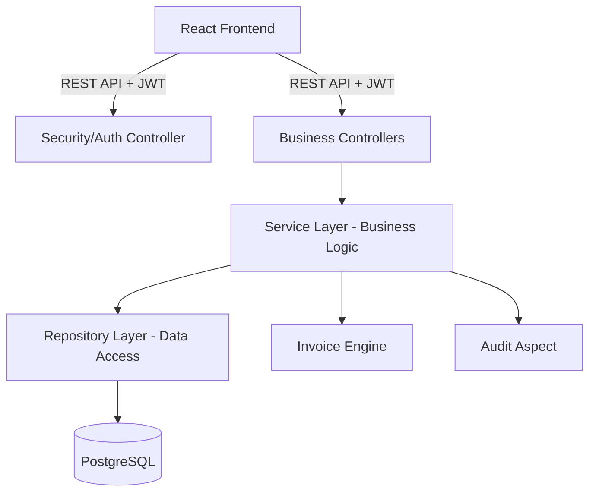

# SalesFlow Pro Management System — Project Report

## 1. Project Overview
**SalesFlow Pro** is a high-performance, enterprise-grade Sales and Inventory Management System designed for modern businesses. It provides a seamless interface for managing products, tracking customer orders, generating real-time analytics, and automating the invoicing process.

The system is built using a **Decoupled Full-Stack Architecture**, ensuring scalability, security, and high performance.

---

## 2. Technology Stack

### Backend (Core Logic & Infrastructure)
*   **Language**: Java 17+ (Refactored for standard boilerplate compatibility)
*   **Framework**: Spring Boot 3.2.x
*   **Security**: Spring Security + JWT (JSON Web Tokens) for stateless authentication.
*   **ORM**: Spring Data JPA / Hibernate.
*   **Database**: PostgreSQL (Relational Data Storage).
*   **PDF Engine**: iText7 (For automated invoice generation).
*   **Logging**: Spring AOP (Aspect-Oriented Programming) for automated audit trails.

### Frontend (User Interface)
*   **Library**: React.js 18 (Vite-based)
*   **State Management**: React Query (TanStack) for server state.
*   **Styling**: Modern Vanilla CSS with a customized Light Professional SaaS Theme.
*   **Icons**: Lucide React.
*   **Charts**: Recharts (For data visualization).

---

## 3. Java Implementation Details

Java serves as the **backbone** of the application, handling all sensitive business logic and data integrity.

### Where Java is Used:
1.  **Security Layer**: Custom JWT Filters and User Authentication services are written in Java to manage access control.
2.  **Business Services**: Complex logic for order processing, stock deduction, and tax calculations reside in the `Service` layer.
3.  **Data Persistence**: Java Entities define the database schema, and Repositories handle optimized PostgreSQL queries.
4.  **Audit System**: An `AuditAspect` interceptor automatically logs every user action (Create/Update/Delete) without modifying core business code.
5.  **Schedulers**: Background Java tasks monitor stock levels every hour and send low-stock alerts.
6.  **Invoice Engine**: A dedicated service that transforms Order data into professional PDF documents.

### Project Metrics:
*   **Java Files**: 49
*   **Java Line Count**: ~2,443 LOC
*   **Backend Coverage**: 100% of the API and Business Logic.

---

## 4. Key Features & Modules

### A. Dashboard & Real-time Analytics
*   Visualizes revenue trends using line charts.
*   Displays top-selling products and salesperson performance.
*   Real-time counters for total orders, customers, and low-stock items.

### B. Inventory Management
*   Full CRUD (Create, Read, Update, Delete) for Products and Categories.
*   Automatic SKU generation and stock tracking.
*   CSV Export/Import functionality for bulk inventory updates.

### C. Order Processing & Invoicing
*   Step-by-step order lifecycle: `Pending` ➔ `Confirmed` ➔ `Shipped` ➔ `Delivered`.
*   Automatic tax and discount calculations.
*   One-click **PDF Invoice Generation** upon delivery.

### D. Security & Auditing
*   Role-Based Access Control (RBAC): Admin vs. Sales Manager vs. Salesperson.
*   Comprehensive Audit Logs: Track "who did what and when" for accountability.

---

## 5. System Architecture
The project follows a clean **Controller-Service-Repository** pattern:

---

## 6. Conclusion
**SalesFlow Pro** demonstrates a robust application of Java and Spring Boot in a production-style scenario. By moving away from dependency-heavy libraries (like Lombok) to standard Java practices, the system ensures long-term maintainability and high compatibility across various server environments.
